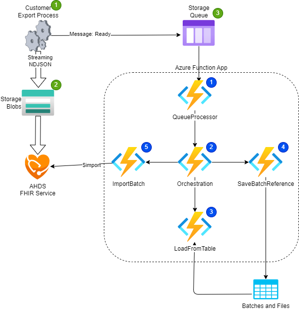

# Project

This MVP sample project is an orchestration process for ingesting large volumes of FHIR bundles (ndjson) into an Azure Health Data Services FHIR Api using the $import endpoint.

The orchestration process is implemented using a Durable Azure Function app written in Java.



## Local Development Setup Guide

1. Clone this repo to your local machine -OR- open in Github Codespaces.
1. Run `az login` AND `azd auth login` to authenticate with your Azure Subscription.
1. Run `azd up` OR `azd provision` to deploy the necessary Azure resources to your subscription.
1. Create a copy of [local.settings.example.json](./local.settings.example.json) and rename it to `local.settings.json`.
1. Update the local.settings.json file you just created with values from your environment using the variable guide below.
1. Run and debug by pressing `F5` in VSCode.

Azure Function Environment Variables

```JSON
    "FHIR_STORAGE_CONN_STR": "<fhir storage>",
    "FHIR_STORAGE_CONTAINER": "data",
    "FHIR_STORAGE_TABLE": "batchtable",
    "FHIR_STORAGE_QUEUE": "fhir-hose",
    "FHIR_SERVER_URL": "https://<fhirWorkspace>-<fhirApi>.fhir.azurehealthcareapis.com",
    "FHIR_IMPORT_MODE": "IncrementalLoad"
```

## Contributing

This project welcomes contributions and suggestions.  Most contributions require you to agree to a
Contributor License Agreement (CLA) declaring that you have the right to, and actually do, grant us
the rights to use your contribution. For details, visit https://cla.opensource.microsoft.com.

When you submit a pull request, a CLA bot will automatically determine whether you need to provide
a CLA and decorate the PR appropriately (e.g., status check, comment). Simply follow the instructions
provided by the bot. You will only need to do this once across all repos using our CLA.

This project has adopted the [Microsoft Open Source Code of Conduct](https://opensource.microsoft.com/codeofconduct/).
For more information see the [Code of Conduct FAQ](https://opensource.microsoft.com/codeofconduct/faq/) or
contact [opencode@microsoft.com](mailto:opencode@microsoft.com) with any additional questions or comments.

## Trademarks

This project may contain trademarks or logos for projects, products, or services. Authorized use of Microsoft 
trademarks or logos is subject to and must follow 
[Microsoft's Trademark & Brand Guidelines](https://www.microsoft.com/en-us/legal/intellectualproperty/trademarks/usage/general).
Use of Microsoft trademarks or logos in modified versions of this project must not cause confusion or imply Microsoft sponsorship.
Any use of third-party trademarks or logos are subject to those third-party's policies.
